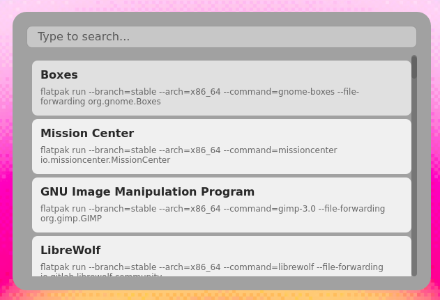

# Swift Launcher

Swift Launcher is a keyboard-first launcher written in Rust + Slint.  
Press a global shortcut (for example `Super+Space`), type a few letters, and run actions instantly.



## Goals

- Minimal latency: open → search → execute fast.
- Great UX: clean UI, solid keyboard navigation, sane defaults.
- Ship it as a solid native binary first, then add a Flatpak build later (if possible).

## Features

- [x] Fuzzy search (ranked) over actions.
- [ ] Shell command actions (optional working directory).
- [x] Desktop app actions (from `.desktop` entries).
- [ ] Project workflows (open folder, run dev server, run tests).
- [ ] Keyboard-only workflow (Up/Down select, Enter execute, Esc close).
- [ ] Optional system tray integration (toggle + quick status).
- [x] Theme config file
- [ ] Config file (TOML/JSON/RON), with optional hot-reload.
- [ ] (Future) Flatpak build and Flatpak-specific actions.

## Installation

### Native

```bash
git clone https://github.com/pezfisk/swift-launcher
cd swift-launcher
cargo build --release
./target/release/swift-launcher
```

#### CONFIGURE ON DESKTOP ENVIROMENTS

## Plugin System

Swift Launcher uses **WebAssembly (WASM) Components** for plugins, allowing you to write extensions in any language while maintaining security and performance.

### Understanding WASM Architecture

**📖 [Read WASM.md](./assets/WASM.md)** for a comprehensive explanation of:
- What WASM is and why we use it
- The Component Model and interfaces
- Shift's WASM architecture and how plugins are loaded
- Memory isolation and security guarantees
- How information flows between host and plugins

**Key benefits:**
- **Polyglot**: Write plugins in Rust, Python, Go, JavaScript, C, Zig, and more
- **Safe**: Each plugin runs in an isolated sandbox
- **Fast**: Near-native performance (95%+ of native speed)
- **Reliable**: One plugin crash doesn't crash Shift

### Creating Your First Plugin

**📖 [Read PLUGINS.md](./assets/PLUGINS.md)** for complete instructions on:
- Building the echo plugin in **Rust**, **Python**, **Go**, **JavaScript**, **C/C++**, and **Zig**
- How to target `wasm32-wasip2`
- Installation and testing
- Best practices for plugin development
- Troubleshooting common issues


## Theming

If no theme.conf exists at `/home/user/.config/swift/theme.conf` a default theme will be used
Here is an example theme.conf for reference:

```ini
[Window]
width=600
height=400
vertical-alignment=center
horizontal-alignment=center
background-color=#1e1e2e
border-radius=16
border-color=#74c7ec
border-width=1

[Action]
max-height=60
option-color=#313244
option-color-selected=#cba6f7
option-border-rodius=10
name-font-size=14
exec-font-size=11
exec-show=false

[Runner]
font-size=16
background-color=#181825
border-color=#45475a
border-width=1
border-radious=8
height=45
color=#cdd6f4
```

## Configuration (Not yet implemented, just for reference)
Default path:
- Native: ~/.config/swift/config.conf

### Example config

```ini
[variables]
editor = "vim"

[actions]
name = "Open dotfiles"
cwd = "/home/$USER/dotfiles"
exec = "$editor /home/$USER/dotfiles"
```

